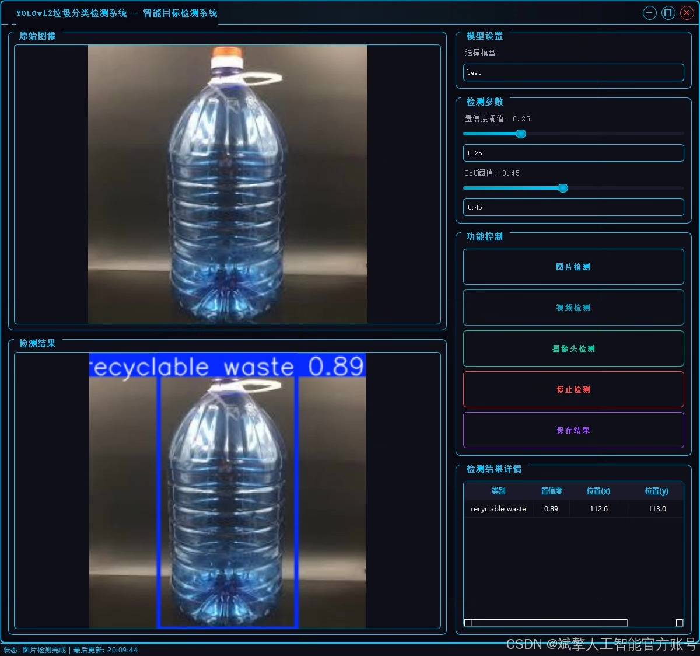
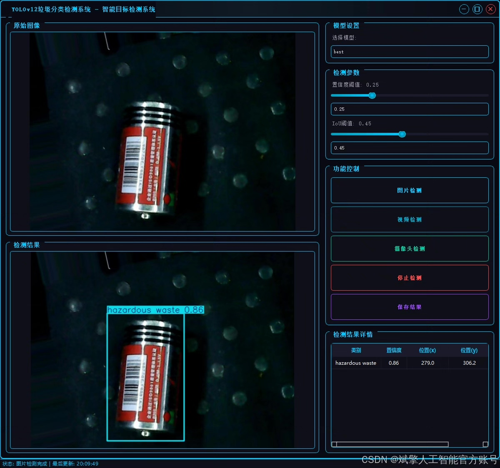
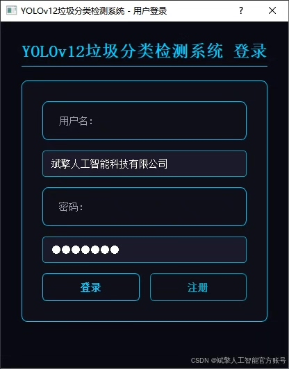
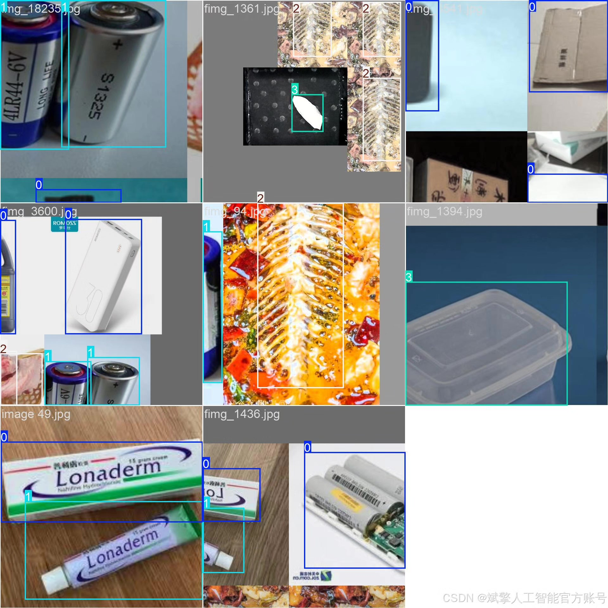
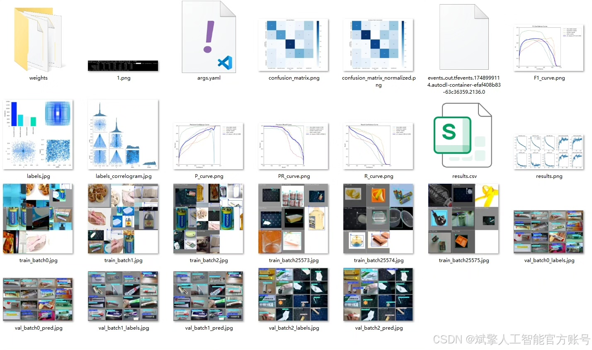
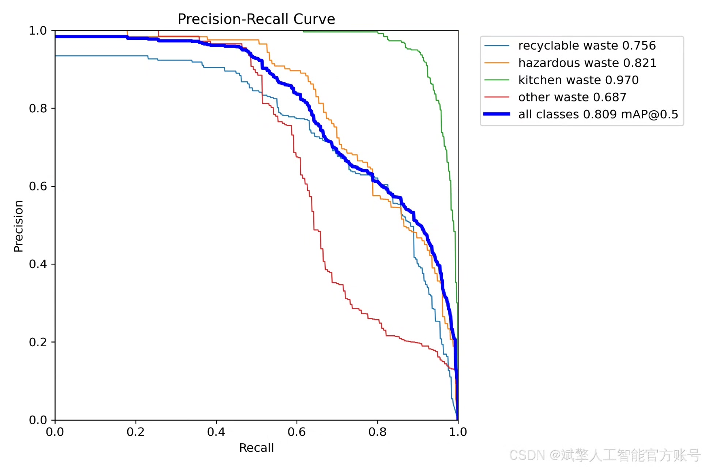
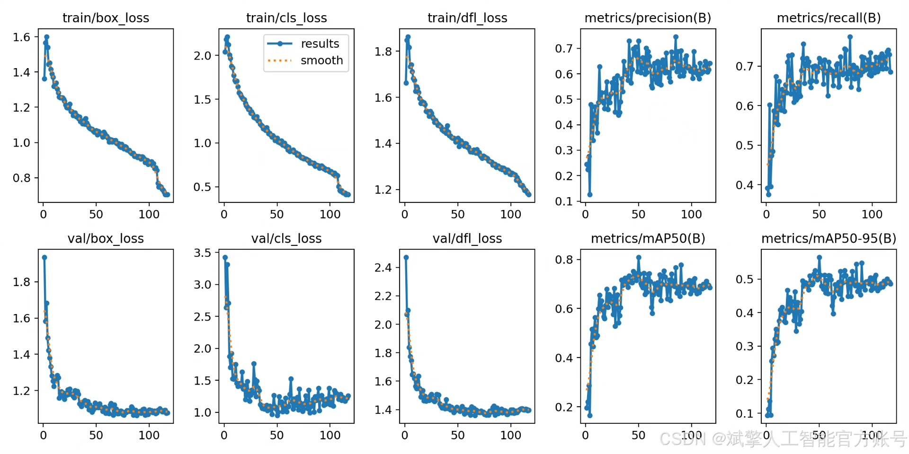
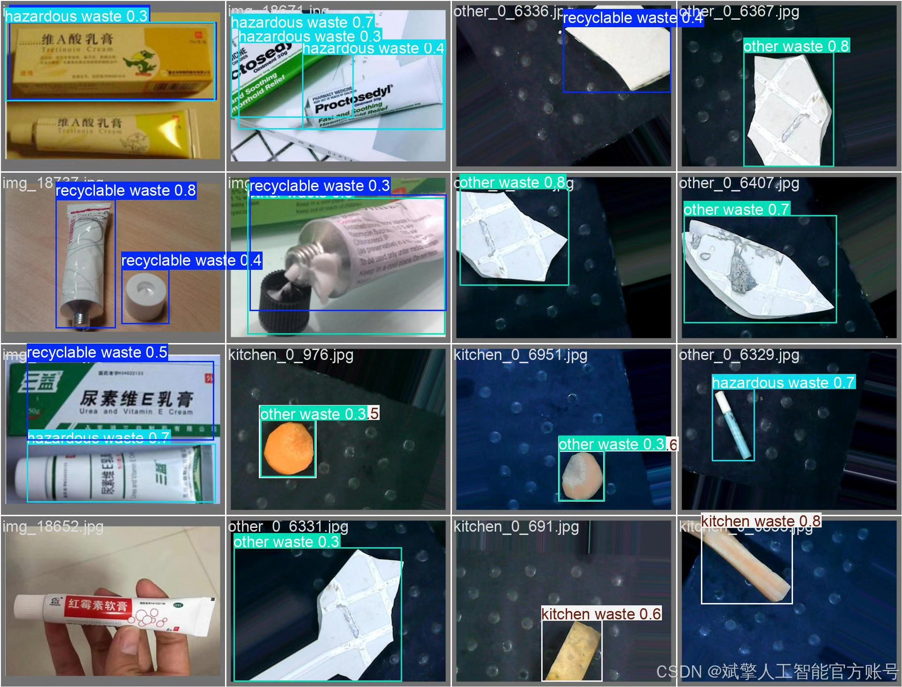

# YOLOv12 Classification System for Waste Sorting

## Body

The YOLOv12 Waste Classification Identification System is based on the deep learning algorithm YOLOv12, and it includes a waste classification identification detection system (YOLOv12+YOLO dataset + UI interface + login registration interface + Python project source code + model).

With the acceleration of urbanization, waste classification has become an important issue in the field of environmental protection. Traditional waste sorting methods rely on manual sorting, which is inefficient and costly. Therefore, this study has developed a highly efficient and accurate waste classification identification detection system based on the YOLOv12 deep learning algorithm. The system detects four types of waste (recyclable materials, hazardous waste, kitchen waste, and other waste) and uses a self-built YOLO format dataset containing 1910 training sets and 833 validation sets for model training. It also integrates a user-friendly UI interface and login registration functions. Experiments show that the system performs excellently in accuracy and real-time performance, providing a feasible technical solution for intelligent waste classification.

✅ User login registration: Supports password verification and security validation.
✅ Three detection modes: Based on the YOLOv12 model, supports image, video, and real-time camera detection, accurately identifying targets.
✅ Dual-screen comparison: Displays the original scene and detection results on the same screen.
✅ Data visualization: Real-time table displays the category, confidence, and coordinates of detected targets.
✅ Intelligent parameter adjustment: Offers a confidence slide bar to dynamically optimize detection accuracy, adapting to different scene needs.
✅ Sci-fi style interaction interface: Dark theme combined with dynamic light effects, reducing visual fatigue and improving operational experience.

## Images

## Payment

Here is a pay link on Stripe ( https://buy.stripe.com/3cs8yP7sY87d0vu9AB ). Please contact me lonlonago@foxmail.com after funding $89, and I will send you a complete data files , thank you!

